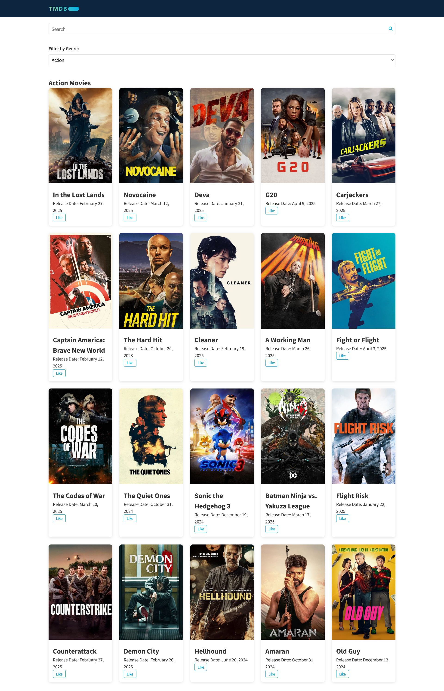
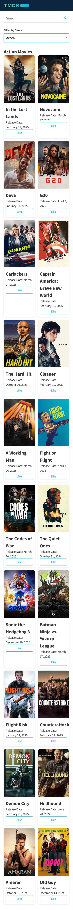

# MovieAPI

## Overview

Movie API is a SPA that allows users to browse and discover movies using The Movie Database (TMDB) API. Users can view popular movies, filter them by genre, and see detailed information about each selected movie.

## Live Demo

Check out the live application here: [Movie Explorer Demo](https://moefedaily.github.io/MovieAPI/)

## Screenshots

The application is responsive and works on both desktop and mobile devices. Screenshots are available for:

- Desktop view
  

- Mobile view
  

## Features

- View popular movies on the homepage
- Filter movies by genre using a dropdown menu
- Click on movie cards to view detailed information
- See cast members for each movie
- Interactive elements including "like" buttons and hover effects

## Project Structure

```
movieAPI/
├── index.html          # Main HTML page
├── css/
│   └── style.css       # CSS styling
├── js/
│   ├── api.js          # TMDB API functions
│   ├── ui.js           # UI rendering functions
│   └── app.js          # Main application logic
└── assets/
    └── Tmdp.png        # TMDB logo
```

## How It Works

1. When the page loads, it displays a grid of popular movies
2. Users can select a genre from the dropdown to filter the movies
3. Clicking on a movie shows its details including poster, overview, and cast
4. The interface is responsive and adapts to different screen sizes

## Technologies Used

- HTML5
- CSS3 (with responsive design)
- JavaScript (Vanilla JS)
- TMDB API

## Setup

1. Clone the repository
2. Insert your TMDB API key in the api.js file
3. Open index.html in your browser
